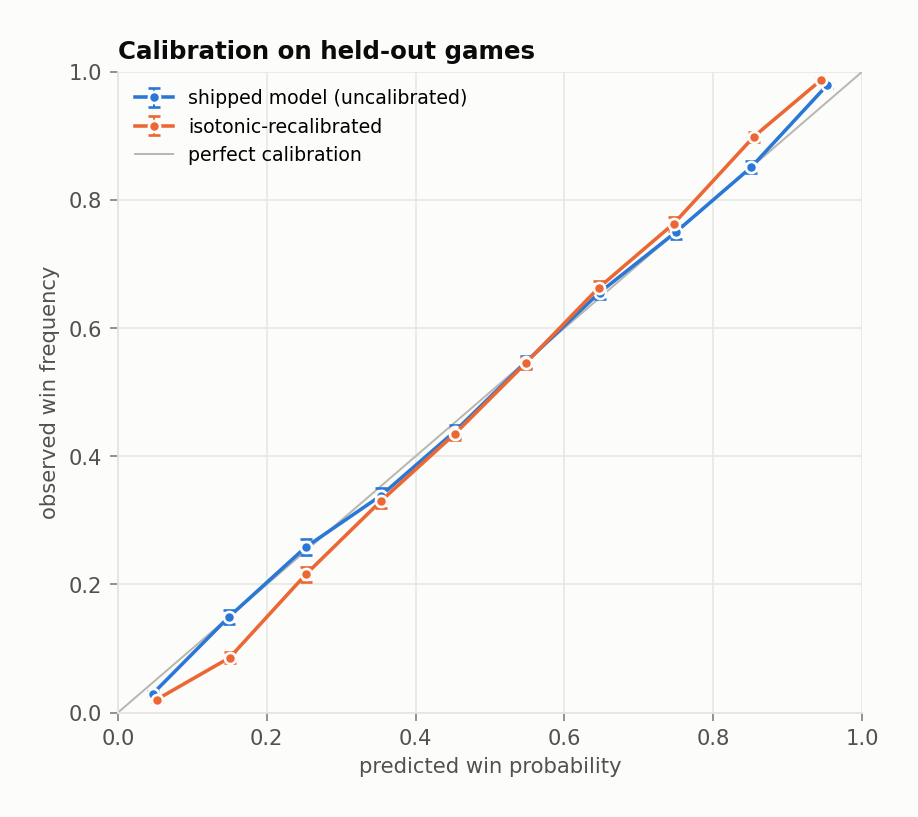

# Live win probability for Pokémon TCG agent battles

A broadcast-style win-probability curve for the Kaggle *Card Battle* (`cabt`)
competition: instead of predicting a winner once before the match, the model
re-estimates each side's chances at **every decision point**, using only the
information that player can actually see.


The problem is a sequential-updating one under imperfect information. Each game
is a chain of ~170 decisions; the state is partly hidden (your opponent's hand
is masked, their prize cards are face down); and the forecast has to stay
coherent over time, not just accurate on average. The interesting question is
not "who wins" but **"is the number honest at every point along the way."**

Built from 1,970 episode replays (8.8 GB of JSON) reduced to **328,063 decision
points** across 151 agents.

---

## Headline results

Held out **394 complete games** (65,302 decision points) from the 1,576 games
used for training; games are split whole, never by row. Every score is quoted
against `prize_only` — logistic regression on the prize differential alone,
which is the number a human player already tracks in their head, and a much
harder baseline than the base rate.

| Model | Brier ↓ | Log loss ↓ | AUC ↑ | ECE ↓ | Brier skill vs. prize-only |
|---|---|---|---|---|---|
| base rate (52.4%) | 0.2494 | 0.6920 | 0.500 | 0.001 | −16.5% |
| **prize differential only** | 0.2142 | 0.6151 | 0.703 | 0.019 | — |
| logistic regression, 93 features | 0.1998 | 0.5791 | 0.753 | 0.011 | +6.7% |
| gradient boosting | 0.1752 | 0.5153 | 0.813 | 0.010 | +18.2% |
| … + isotonic recalibration | 0.1756 | 0.5183 | 0.814 | 0.025 | +18.0% |
| **… + causal Kalman filter** *(shipped)* | **0.1747** | **0.5141** | **0.814** | **0.009** | **+18.4%** |

Three findings, in descending order of how much they surprised me.

### 1. The filter's real job is coherence, not accuracy

The natural next step after a per-state model is to smooth its output, and the
natural way to sell that is "smoothing improves log loss." It barely does —
0.5153 to 0.5141. Against an honest pass-through control, the filter's effect
on the scoring rules is close to nil:

| Smoothing | Brier | Log loss | ECE | Mean step | Martingale slope | *p* |
|---|---|---|---|---|---|---|
| pass-through | 0.1752 | 0.5153 | 0.0095 | 0.0389 | **−0.0183** | ~0 |
| **tuned (q = 0.75)** | 0.1747 | 0.5141 | 0.0089 | **0.0245** | **+0.0017** | 0.008 |
| moderate (q = 0.5) | 0.1747 | 0.5142 | 0.0099 | 0.0226 | +0.0038 | ~0 |
| heavy (q = 0.05) | 0.1760 | 0.5182 | 0.0211 | 0.0140 | +0.0113 | ~0 |

What it does buy is a **37% reduction in path jitter** and a near-elimination of
a martingale violation. A correctly specified probability path must satisfy
E[p<sub>t+1</sub> − p<sub>t</sub> | p<sub>t</sub>] = 0: knowing the current level
should tell you nothing about which way it moves next. Regressing the next step
on the current level, the raw per-state model has a firmly **negative** slope —
it overshoots and gets pulled back, the signature of a memoryless model reacting
to every twitch of the board. Over-smooth it instead and the slope goes
**positive**, because a laggy path keeps drifting the direction it was already
going. The tuned filter sits just past the zero crossing, cutting the violation
by about 90% and flipping its sign.

It does not *remove* the violation. At 64,514 test transitions a slope of
+0.0017 is still significant (*p* = 0.008), and the same is true of every
setting in the sweep. The honest summary is that the filter buys most of the
coherence back, not all of it.


*(An earlier version of this repo, built on a 549-game subsample, reported that
the tuned filter restored the martingale property outright and that the test
independently selected the same `q` chosen by log loss. At four times the data
that result does not survive — the effect was real but the "passes the test"
part was low statistical power. The sweep above is what the full archive says.)*

### 2. Recalibration helps at small sample sizes and hurts at large ones

AUC 0.81 sounds respectable and is nearly irrelevant. A win-probability curve is
only worth showing if 70% means 70%. On the full archive the boosted model is
already well calibrated straight out of the box — ECE 0.0095 — and isotonic
recalibration makes it **worse**, roughly doubling ECE to 0.0240 and degrading
log loss, while adding nothing to Brier.



This reverses at small sample sizes, which is the interesting part. On a
549-game subsample the uncalibrated model was visibly over-confident (ECE 0.049)
and isotonic halved that. The recalibration step was fixing a small-sample
pathology, not a structural one, and once there is enough data to fit the
boosted model properly it becomes a source of noise. The shipped model is
therefore uncalibrated, and `reports/tables/calibration_variants.csv` records
all three options so the choice is auditable rather than asserted.

Accuracy is also strongly phase-dependent. Before turn six the model barely
beats the prize-differential baseline; the edge arrives as the board resolves.


### 3. Prizes and hit points carry it; status conditions carry nothing

Permutation importance is computed **by family**, not per feature, because the
features inside a family are deliberately collinear — `my_prizes`, `opp_prizes`
and `prize_diff` encode the same thing three ways, and shuffling them one at a
time lets the model read the twin and report near-zero importance for all three.


The prize differential dominates (+0.0450 Brier when shuffled), board hit points
are second (+0.0292), and card economy — hand, deck and discard sizes — is a
real third (+0.0191). Status conditions contribute nothing measurable at all.
The ablation is consistent and monotone: core game state 0.1772, plus the
legal-action menu 0.1766, plus history/momentum terms 0.1761, plus the agent's
remaining thinking-time budget 0.1752. Every group earns a little; none of them
transforms the model.

---

## What I would not claim

- **Card-level win rates are archetype win rates.** Decks are chosen, not
  assigned, and the top of the table gives the game away: `Fan Rotom`, `Buneary`
  and `Mega Lopunny ex` all show 61.3% across exactly 447 decks, because they
  are the same deck. The table measures which lists won, not which cards cause
  wins, and no causal claim is made.
- **Unseen-agent performance looks better, and that is suspicious.** Holding out
  whole *agents* rather than whole games gives Brier 0.1387 and AUC 0.889 —
  better than the episode split, not worse. The likely explanation is that the
  held-out agents' 95 games are an easier subpopulation (more lopsided matchups
  resolve earlier), not that the model generalises unusually well. I would treat
  this as "no evidence of an agent-specific overfit" and nothing stronger.
- **The model is weakest exactly where a forecast is most interesting.** In the
  first two turns it is barely better than a coin flip (Brier 0.239, AUC 0.583).
  Most of the headline skill is earned after turn eight, when the board has
  largely decided things anyway.
- **30 of the archive's 2,000 episodes are missing** — a transfer failure, not a
  filter. Everything here is 1,970 games; rerunning on the complete archive will
  move the third decimal place, not the conclusions.

## What the full archive settled

Running the whole archive rather than a subsample changed real conclusions, so
it is worth recording which ones. **First-player advantage is now established**:
the player moving first won 1,049 of 1,970 games, 53.2% (95% CI 51.0–55.4%,
*p* = 0.0042). On 549 games the same estimate was 53.9% with *p* = 0.073 — the
right answer, but not yet demonstrable. The martingale and calibration findings
above moved in the other direction. Both are the reason the pipeline is built to
run the full 8.8 GB in one command rather than to be convincing on a sample.

---

## How it works

**Decision points, not turns.** A row is emitted wherever a player is `ACTIVE`
and holds a non-empty legal-action menu — exactly the moment a player would want
a number. Both seats contribute rows, always from the acting player's own point
of view, so `my_*` means the actor and `opp_*` their opponent and the label is
"did the actor go on to win". That doubles the data and makes seat bias
impossible to learn by accident: which seat you are is exposed explicitly as
`is_first_player` rather than smuggled in through the perspective. The test
suite pins the convention down by building a board, viewing it from each seat,
and asserting every differential is exactly negated.

**Imperfect information is preserved, not repaired.** The replays mask the
opponent's hand (`null`, with only a count) and keep prize cards face down, and
the features respect that. During setup the opponent's active Pokémon is face
down too; rather than encode "unknown HP" as zero HP, those slots become `NaN`
— read natively by the boosted model, median-imputed in-pipeline for the linear
baselines — alongside an explicit `opp_hidden_pokemon` count. Each episode also
carries a fully-revealed `visualize` payload with both decklists; it is used for
card names and the descriptive metagame tables and **never** reaches the feature
matrix.

**Two leakage traps, both closed deliberately.**

The first is the clock. An episode terminates the instant somebody wins, so
`step_index` and `n_steps` are direct functions of the outcome. Both are carried
for bookkeeping and excluded from the feature set, with a test asserting it.
`turn` stays in — that is a legitimate in-game observable.

The second is the setup phase. The two prize piles are dealt a moment apart, so
a seat's first few observations can read "opponent 6 prizes, me 0" — which the
prize-differential feature would take for a nearly-won game rather than an
un-dealt board. The parser drops decisions until a seat has seen both piles at
full size.

**Splits respect game boundaries everywhere.** Rows within a game are strongly
dependent and the two seats of a game share an outcome, so a random row split
would put near-duplicates of a test state in training and flatter every metric.
Episodes are held out whole; the calibration comparison's cross-fitting folds
are `GroupKFold` on episode id; the filter's `q` is tuned on a further disjoint
slice of *training* episodes, never on the test set.

**The filter.** A local-level state-space model on the win-probability logit, one
chain per (episode, seat):

x<sub>t</sub> = x<sub>t−1</sub> + w<sub>t</sub>, w ~ N(0, q) &nbsp;&nbsp;·&nbsp;&nbsp;
z<sub>t</sub> = x<sub>t</sub> + v<sub>t</sub>, v ~ N(0, r)

where z is the per-state model's output. Only the **forward** pass runs — no
smoothing pass — so the estimate at decision point *t* depends on nothing after
*t* and remains a legitimate real-time number. Tests assert the causality
directly (perturbing a later observation leaves earlier outputs bit-identical)
and that chains never bleed into each other.

### The baseline worth beating


Two prizes up is worth 85%; two down is 27%. Any model that cannot beat this
lookup table is not earning its complexity. The full-feature model's +18% Brier
skill over it is the headline claim of the project, and it is a modest, real
number rather than an impressive, leaky one.

### What the archive looks like

1,970 games, 151 distinct agents, 179 distinct cards, a median of 12 turns and
167 decision points per game, no draws, and no non-`DONE` statuses. Games end by
prizes in 86.8% of cases; 5.5% end with the loser having no Pokémon left to
promote and 2.3% by running out of deck (5.4% stay unclassified, because the
final observation is one play stale). Game length has a long tail — the median
is 172 replay steps, the longest game runs 1,085.

---

## Reproducing

Requires Python 3.11+ and the packages in `requirements.txt` (numpy, pandas,
scipy, scikit-learn, matplotlib — no Arrow or GPU dependency; `pyarrow` is
optional and only enables `--parquet`).

```bash
pip install -r requirements.txt

# 1. Run everything against the 20 gzipped replays committed to this repo (~20s)
make sample
python scripts/train.py --data data/sample_processed --out /tmp/reports

# 2. Or against the real archive: download the Kaggle dataset, unzip, then
make dataset REPLAYS=~/Downloads/archive   # ~2.5 min for 2,000 episodes
make train                                 # ~10 min for 328k decision points
make analyse

make test                                  # 49 tests, ~5s, no network needed
```

`make dataset` reduces 8.8 GB of JSON to a single 24 MB table by streaming one
file at a time across a worker pool; the raw archive never needs to fit in
memory and is git-ignored. Every number and figure in this README is written to
`reports/` by `make train` and `make analyse`, and committed, so the results are
checkable without running anything.

## Repository layout

```
src/cabt/
  schema.py     replay format constants, enum codes, the non-feature blocklist
  parse.py      streaming replay -> decision-point records
  features.py   93 features from one seat's own view; NaN for the genuinely unknown
  dataset.py    parallel build, trajectory features, episode- and agent-level splits
  models.py     baselines, calibration wrapper, the causal logit Kalman filter
  evaluate.py   proper scoring rules, reliability, path volatility, martingale test
  analysis.py   descriptive tables with Wilson intervals; online Elo
  pipeline.py   the experiment: ladder, ablation, filter sweep, unseen-agent check
  plot.py       figures
scripts/        build_dataset.py · train.py · analyse.py
tests/          49 tests: parser invariants, leakage, perspective symmetry,
                filter causality, metric correctness on known cases
data/sample/    20 gzipped replays (1.3 MB) so CI runs the real pipeline
docs/           reverse-engineered notes on the replay format
reports/        generated metrics, tables and figures (committed)
```

## Data

[Kaggle Card Battle (`cabt`) episode replays](https://www.kaggle.com/) — 2,000
JSON episode files, 9.5 GB unzipped. The format is undocumented; the structural
notes, enum codes and gotchas in [`docs/data-schema.md`](docs/data-schema.md) are
reverse-engineered from the files and asserted by the test suite.

## License

MIT
