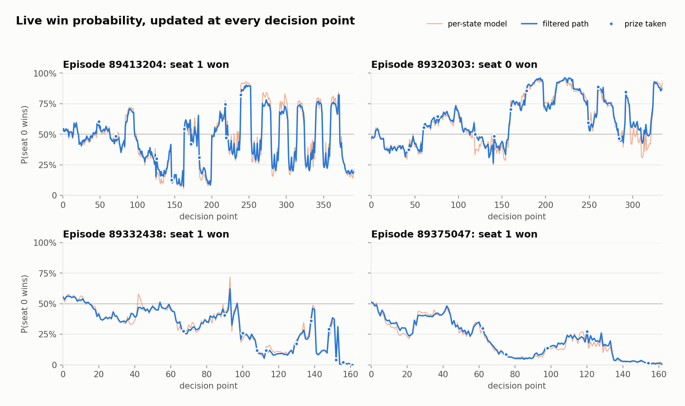
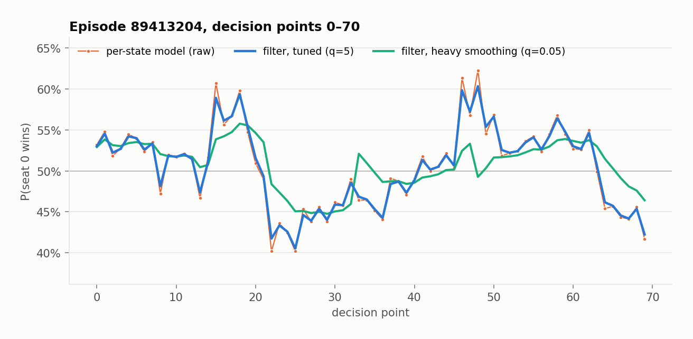
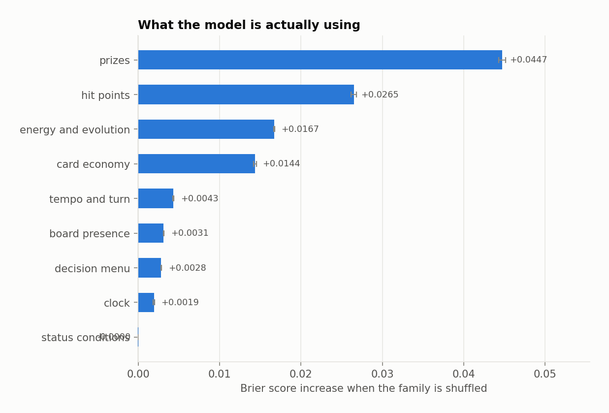
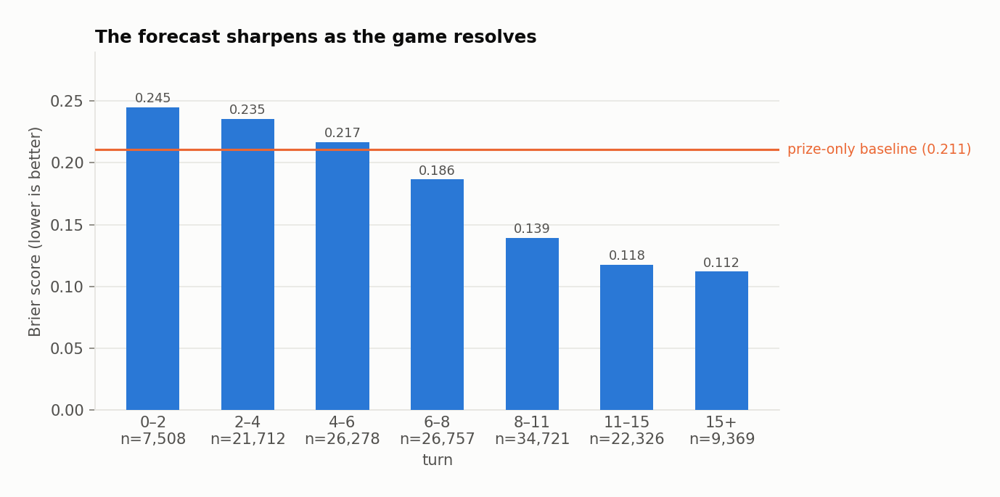
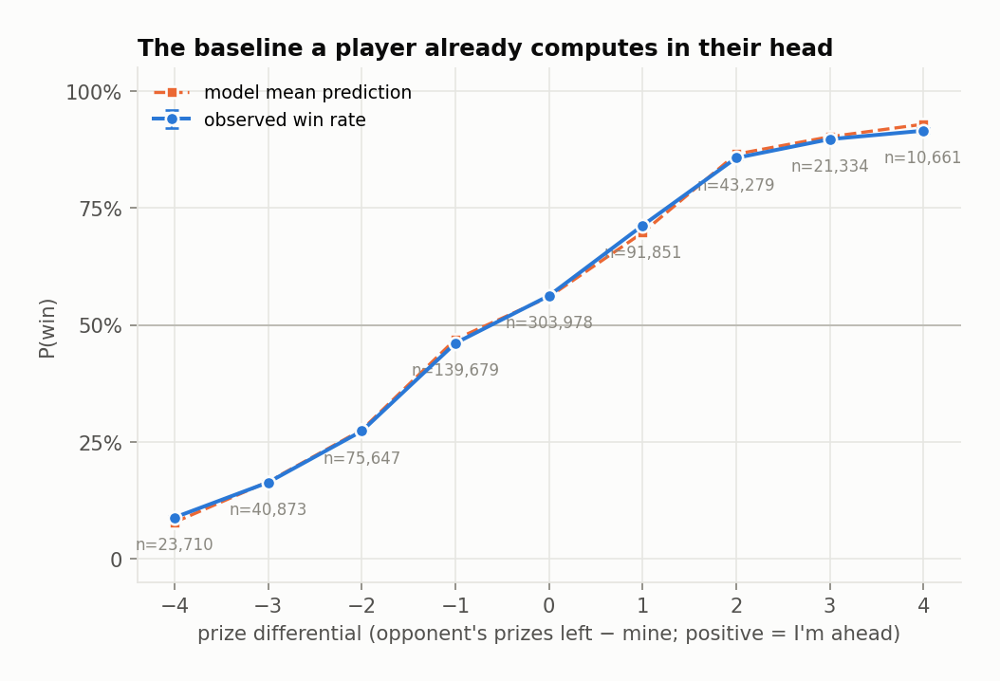

# Live win probability for Pokémon TCG agent battles

A broadcast-style win-probability curve for the Kaggle *Card Battle* (`cabt`)
competition: instead of predicting a winner once before the match, the model
re-estimates each side's chances at **every decision point**, using only the
information that player can actually see.



The problem is a sequential-updating one under imperfect information. Each game
is a chain of ~170 decisions; the state is partly hidden (your opponent's hand
is masked, their prize cards are face down); and the forecast has to stay
coherent over time, not just accurate on average. The interesting question is
not "who wins" but **"is the number honest at every point along the way."**

Built from the complete daily archive: 4,518 episode replays, 21.5 GB of JSON,
reduced to **751,012 decision points** across 183 agents.

> **Correction, and why it matters.** Earlier commits of this README claimed the
> same thing about 2,000 episodes and 8.9 GB. That was wrong. 2,000 files were
> what had been copied onto the machine, not what the archive contained, and
> they were not a random 2,000: sorted by episode id they are also sorted by
> creation time, so the old run covered 00:02 to 13:50 of a single day and
> dropped the other ten hours. The dataset ships a `manifest.csv` listing all
> 4,518 episodes, and one join against it would have caught this immediately.
> It is now committed at [`data/manifest.csv`](data/manifest.csv) and the
> coverage check is the first thing `make dataset` output should be compared
> against. Several conclusions below changed when the missing half arrived, and
> they are flagged where they did.

---

## Headline results

Every score below is the **mean over five independent episode-level splits**,
each holding out 903 whole games, with the standard deviation across splits.
Scores are quoted against `prize_only`, logistic regression on the prize
differential alone, which is the number a human player already tracks in their
head and a much harder baseline than the base rate.

| Model | Brier ↓ | Log loss ↓ | AUC ↑ | ECE ↓ | Brier skill vs. prize-only |
|---|---|---|---|---|---|
| **prize differential only** | 0.2118 ± 0.0043 | 0.6098 | 0.711 | 0.022 | n/a |
| gradient boosting | 0.1752 ± 0.0050 | 0.5158 | 0.812 | 0.011 | +17.3% ± 1.8 |
| … + causal Kalman filter | 0.1750 ± 0.0050 | 0.5155 | 0.812 | 0.012 | +17.4% ± 1.8 |
| … + isotonic recalibration | 0.1750 ± 0.0049 | 0.5149 | 0.812 | 0.011 | +17.4% ± 1.8 |
| **… + isotonic + filter** *(shipped)* | **0.1750 ± 0.0049** | **0.5151** | **0.812** | 0.013 | **+17.4% ± 1.8** |

Reporting five splits rather than one is not ceremony. It is the single most
important methodological decision in the repo, and I arrived at it the hard way.

### 1. Every model difference here is smaller than the split-to-split noise

Holding out 903 of 4,516 games leaves a standard deviation of **±0.0049 Brier**
between splits. All the differences worth arguing about, calibrated versus not
and filtered versus not, are 0.0002 or smaller. On a single split they are
noise, and they are an order of magnitude below the thing that varies.

The striking part is that **more data did not shrink this**. Going from 2,000
games to 4,516 more than doubled the test set in every split, which should have
cut the sampling component of that spread by about a third. Instead the spread
held steady or grew: prize-only ±0.0044 → ±0.0043, gradient boosting ±0.0044 →
±0.0050. Between-split variation is therefore not mostly sampling noise in the
test set; the games themselves differ. The archive now spans a full day and 183
agents rather than a 14-hour window and 151, which is the obvious candidate, but
this repo does not test that and I am not claiming it.

I learned to distrust single splits by watching my own conclusions flip. An
earlier version of this project ran on a 549-game subsample and reported that
isotonic recalibration halved calibration error. Rerunning on 1,970 games
reversed it: isotonic now appeared to *double* ECE, and I rewrote the README to
say recalibration was harmful. Adding 30 more games reversed it a third time.
Three different answers from three defensible runs, none of them wrong
arithmetic. The split was simply doing the talking.

The fix is the paired comparison. Run the same five splits for both variants and
subtract:

| Split | Δ Brier (isotonic − raw) | Δ ECE (isotonic − raw) |
|---|---|---|
| 0 | +0.00011 | +0.0003 |
| 1 | −0.00013 | +0.0036 |
| 2 | −0.00068 | −0.0035 |
| 3 | −0.00010 | +0.0013 |
| 4 | −0.00034 | −0.0016 |

**This is a retraction.** On 2,000 games isotonic won 5 of 5 on both metrics and
I wrote that the effect was "real, just small." On the full archive it wins
**4 of 5 on Brier and 2 of 5 on ECE**, with a mean ΔECE of +0.000005, which is
nothing. The sign test that looked like *p* = 0.031 is now *p* = 0.19 on Brier
and a coin flip on ECE. The honest summary is that cross-fitted isotonic is a
**wash**: it does not hurt, it costs one extra cross-validated fit, and the
earlier claim that it reliably helps was an artifact of having half the data.
What survives is the method, not the result.

### 2. The filter buys path coherence, and significance is the wrong lens

A correctly specified probability path must be a martingale:
E[p<sub>t+1</sub> − p<sub>t</sub> | p<sub>t</sub>] = 0. Knowing the current level
should tell you nothing about which way it moves next. Regressing the next step
on the current level, across the same five splits:

| Model | Martingale slope | *p* across the 5 splits |
|---|---|---|
| gradient boosting | −0.0126 ± 0.0013 | ~0 in all five |
| **gbdt + filter** | **+0.0028 ± 0.0005** | 6e-17 to 3e-07, significant in all five |
| gbdt + isotonic | −0.0087 ± 0.0011 | ~0 in all five |
| gbdt + isotonic + filter *(shipped)* | +0.0046 ± 0.0004 | ~0 in all five |

The raw per-state model has a firmly negative slope: it overshoots and gets
pulled back, the signature of a memoryless model reacting to every twitch of the
board. The filter shrinks that by a factor of 4.5, from −0.0126 to +0.0028.
Over-smooth instead and the slope keeps climbing (+0.0071 at q=0.5, +0.0130 at
q=0.05), because a laggy path keeps drifting the way it was already going.

**Second retraction.** The previous README said `gbdt + filter` was "not
significant in four of five splits" and called it the one martingale-clean
configuration. That is gone. With 751k decision points instead of 333k, the
filtered path's residual slope is detectable in all five splits at *p* ≤ 3e-07.
Nothing about the forecast got worse; the test got more powerful. This is the
ordinary behaviour of a null-hypothesis test as *n* grows, and it is exactly why
the effect size belongs in the table and the *p*-value does not deserve the
verdict. Judged on effect size the conclusion is unchanged and better supported:
the filter removes most of the incoherence, and no configuration removes all of
it.

The filter's other job is visible without any test. It cuts the mean absolute
step from 0.034 to 0.029 and the mean largest swing within a game from 0.270 to
0.235, while improving Brier by 0.0001. That is the trade it is actually making:
a visibly calmer path for no measurable accuracy cost.



*(An earlier version of this README also claimed the martingale test
independently confirmed the `q` chosen by log loss. It does not. That was one
split's p-value read as a result.)*

### 3. Prizes and hit points carry it; status conditions carry nothing

Permutation importance is computed **by family**, not per feature, because the
features inside a family are deliberately collinear. `my_prizes`, `opp_prizes`
and `prize_diff` encode the same thing three ways, so shuffling them one at a
time lets the model read the twin and report near-zero importance for all three.



The prize differential dominates (+0.0447 Brier when shuffled), board hit points
are second (+0.0265), then energy and evolution state (+0.0167) and card economy
(+0.0144). Status conditions contribute nothing measurable at all. The ablation
is consistent: core game state 0.1778, plus the legal-action menu 0.1762, plus
history and momentum terms 0.1766 (**the trajectory features make it slightly
worse**), plus the thinking-time budget 0.1758. Lags and EWMAs of the state add
nothing the per-state features do not already carry, which is the other reason
the sequential structure is handled by the filter rather than by feature
engineering. This was the one finding the extra data left completely intact.

Accuracy is strongly phase-dependent. Before turn six the model barely beats the
prize-differential baseline; the edge arrives as the board resolves.



---

## What I would not claim

- **The model is weakest exactly where a forecast is most interesting.** In the
  first two turns it is close to a coin flip (Brier 0.245, AUC 0.561). Most of
  the headline skill is earned after turn eight, once the board has largely
  decided things anyway.
- **Card-level win rates are archetype win rates.** Decks are chosen, not
  assigned, and the table gives it away: `Bulbasaur`, `Ivysaur` and
  `Mega Venusaur ex` all show 62.2% across exactly 74 decks, because they are
  the same deck. The table measures which lists won, not which cards cause wins.
- **Isotonic recalibration is not doing anything for you here.** See the
  retraction above. It is in the shipped stack because it is harmless and
  cross-fitting it correctly is part of what the repo demonstrates, not because
  the numbers justify it.
- **Unseen-agent generalisation costs real skill.** Holding out whole *agents*
  rather than whole games gives Brier 0.1833 and 12.9% skill, against 0.1750 and
  17.4% on the episode split. A quarter of the edge does not survive meeting an
  opponent type the model has never seen. On 2,000 games this check came out
  *better* than the episode split, which I flagged at the time as suspicious;
  with 237 held-out episodes instead of 99 it now behaves the way it should, and
  the earlier result was small-sample noise.
- **Five splits are not five independent experiments.** They resample the same
  4,516 games, so the paired sign tests above are weaker than their nominal
  *p*-values suggest.
- **The archive is a rating-filtered sample, not a random one.** Kaggle selects
  these replays daily "ranked by average agent rating" under a 20 GiB/day cap,
  so every game here is drawn from the stronger tail of play. Everything
  descriptive is conditional on that: the first-player advantage is 53.7% *among
  highly rated agents*, the card and archetype win rates describe what strong
  decks did, and the Elo table rates agents on a filtered subset of their games
  rather than on all of them. A uniform sample of the population could give
  different numbers, and there is no way to check that from inside this dataset.
  `data/manifest.csv` carries a per-episode `avg_score`, so the *shape* of the
  selection is measurable from here even though its effect is not; the pipeline
  does not yet use it, and that is the most obvious next piece of work.

## What scaling the data settled

Running the complete archive rather than the first 44% of it changed real
conclusions, in both directions.

**First-player advantage is now firmly established.** The player moving first won
2,424 of 4,516 games, 53.7% (95% CI 52.2–55.1%, *p* = 8.3e-07). On 2,000 games
the estimate was 53.4% at *p* = 0.0029; on 549 games it was 53.9% at *p* = 0.073,
the right answer but not yet demonstrable.

**The calibration result did not survive**, and the filter's significance claim
inverted for reasons of statistical power rather than modelling. Both are
documented as retractions above rather than quietly edited out, because the
pattern of which findings are fragile is more useful than any one of them.

---

## How it works

**Decision points, not turns.** A row is emitted wherever a player is `ACTIVE`
and holds a non-empty legal-action menu, which is exactly the moment a player
would want a number. Both seats contribute rows, always from the acting player's own point
of view, so `my_*` means the actor and `opp_*` their opponent and the label is
"did the actor go on to win". That doubles the data and makes seat bias
impossible to learn by accident: which seat you are is exposed explicitly as
`is_first_player` rather than smuggled in through the perspective. The test
suite pins the convention down by building a board, viewing it from each seat,
and asserting every differential is exactly negated.

**Imperfect information is preserved, not repaired.** The replays mask the
opponent's hand (`null`, with only a count) and keep prize cards face down, and
the features respect that. During setup the opponent's active Pokémon is face
down too. Rather than encode "unknown HP" as zero HP, those slots become `NaN`,
read natively by the boosted model and median-imputed in-pipeline for the linear
baselines, alongside an explicit `opp_hidden_pokemon` count. Each episode also
carries a fully-revealed `visualize` payload with both decklists; it is used for
card names and the descriptive metagame tables and **never** reaches the feature
matrix.

**Two leakage traps, both closed deliberately.**

The first is the clock. An episode terminates the instant somebody wins, so
`step_index` and `n_steps` are direct functions of the outcome. Both are carried
for bookkeeping and excluded from the feature set, with a test asserting it.
`turn` stays in, because that is a legitimate in-game observable.

The second is the setup phase. The two prize piles are dealt a moment apart, so
a seat's first few observations can read "opponent 6 prizes, me 0", which the
prize-differential feature would take for a nearly-won game rather than an
un-dealt board. The parser drops decisions until a seat has seen both piles at
full size.

**Splits respect game boundaries everywhere.** Rows within a game are strongly
dependent and the two seats of a game share an outcome, so a random row split
would put near-duplicates of a test state in training and flatter every metric.
Episodes are held out whole; the isotonic calibrator's cross-fitting folds are
`GroupKFold` on episode id; the filter's `q` is tuned on a further disjoint slice
of *training* episodes, never on the test set.

**The filter.** A local-level state-space model on the win-probability logit, one
chain per (episode, seat):

x<sub>t</sub> = x<sub>t−1</sub> + w<sub>t</sub>, w ~ N(0, q) &nbsp;&nbsp;·&nbsp;&nbsp;
z<sub>t</sub> = x<sub>t</sub> + v<sub>t</sub>, v ~ N(0, r)

where z is the per-state model's output. Only the **forward** pass runs, with no
smoothing pass, so the estimate at decision point *t* depends on nothing after
*t* and remains a legitimate real-time number. Tests assert the causality
directly (perturbing a later observation leaves earlier outputs bit-identical)
and that chains never bleed into each other.

### The baseline worth beating



Two prizes up is worth 86%; two down is 27%. Any model that cannot beat this
lookup table is not earning its complexity. The full-feature model's ~17% Brier
skill over it is the headline claim of the project, and it is a modest, real
number rather than an impressive, leaky one.

### What the archive looks like

4,518 games, 183 distinct agents, 187 distinct cards, a median of 12 turns and
166 decision points per game, no draws, and no non-`DONE` statuses. Games end by
prizes in 87.8% of cases; 5.2% end with the loser having no Pokémon left to
promote and 1.9% by running out of deck (5.0% stay unclassified, because the
final observation is one play stale). Game length has a long tail: the median is
171 replay steps, and the longest game runs 1,085.

---

## Reproducing

Requires Python 3.11+ and the packages in `requirements.txt` (numpy, pandas,
scipy, scikit-learn, matplotlib). There is no Arrow or GPU dependency; `pyarrow`
is optional and only enables `--parquet`.

```bash
pip install -r requirements.txt

# 1. Run everything against the 20 gzipped replays committed to this repo (~20s)
make sample
python scripts/train.py --data data/sample_processed --out /tmp/reports

# 2. Or against the real archive: download the Kaggle dataset, unzip, then
make dataset REPLAYS=~/Downloads/archive   # ~9 min for 4,518 episodes
make train                                 # ~45 min (five splits + ablation + sweep)
make analyse

make test                                  # 49 tests, ~6s, no network needed
make verify                                # re-derive all 92 README figures from reports/
```

`make dataset` reduces 21.5 GB of JSON to a single 54 MB table by streaming one
file at a time across a worker pool and flushing rows into columnar batches as it
goes; the raw archive never needs to fit in memory and is git-ignored. Peak
resident size is about 2 GB. Every number and figure in this README is written to
`reports/` by `make train` and `make analyse`, and committed, so the results are
checkable without running anything. `make verify` re-derives all 92 figures
quoted in this README from those tables and fails on any drift. It runs in CI, so
a retrain that moves a number cannot silently leave the prose behind. It is what
caught 85 stale figures when the missing half of the archive arrived.

## Repository layout

```
src/cabt/
  schema.py     replay format constants, enum codes, the non-feature blocklist
  parse.py      streaming replay -> decision-point records
  features.py   93 features from one seat's own view; NaN for the genuinely unknown
  dataset.py    parallel build, trajectory features, episode- and agent-level splits
  models.py     baselines, calibration wrapper, the causal logit Kalman filter
  evaluate.py   proper scoring rules, reliability, path volatility, martingale test
  analysis.py   descriptive tables with Wilson intervals; online Elo
  pipeline.py   the experiment: ladder, repeated splits, ablation, filter sweep,
                calibration variants, unseen-agent check
  plot.py       figures
scripts/        build_dataset.py · train.py · analyse.py · verify_readme.py
tests/          49 tests: parser invariants, leakage, perspective symmetry,
                filter causality, metric correctness on known cases
data/sample/    20 gzipped replays (1.3 MB) so CI runs the real pipeline
data/manifest.csv  the archive's own episode list, for checking coverage
docs/           reverse-engineered notes on the replay format
reports/        generated metrics, tables and figures (committed)
```

The tables worth opening first are `reports/tables/repeated_splits.csv` (the
headline numbers, with their spread) and `repeated_splits_long.csv` (per-split,
for the paired comparisons above).

## Data

"The Pokemon Company - PTCG AI Battle Challenge Simulation Episodes", a Kaggle
simulations-competition dataset of `cabt` episode replays, released under
**CC0 1.0 (public domain)**. This project uses all 4,518 JSON episode files,
21.5 GB unzipped, from a single daily release.

Two things about the dataset are worth knowing before reusing any number here.
Kaggle selects each day's replays by average agent rating under a 20 GiB cap, so
the sample is drawn from the stronger tail of play rather than uniformly (see
"What I would not claim"). And the dataset ships a `manifest.csv` listing every
included episode with its `avg_score`, committed here as
[`data/manifest.csv`](data/manifest.csv). Joining the build output against it is
how the missing-half error at the top of this README was found, and its score
column is the obvious way to quantify the selection and to test whether forecast
accuracy varies with agent strength. Neither is done yet.

The replay format itself is undocumented. The structural notes, enum codes and
gotchas in [`docs/data-schema.md`](docs/data-schema.md) are reverse-engineered
from the files and asserted by the test suite.

## License

MIT
